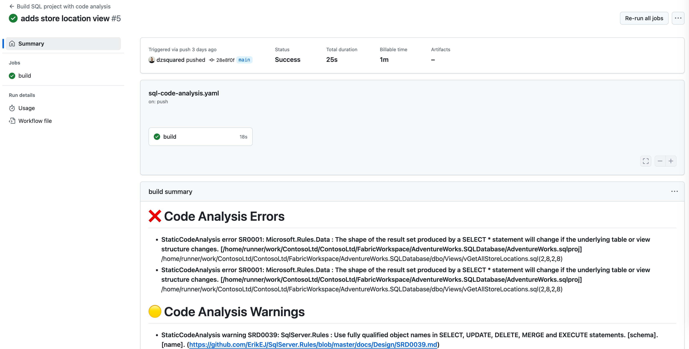
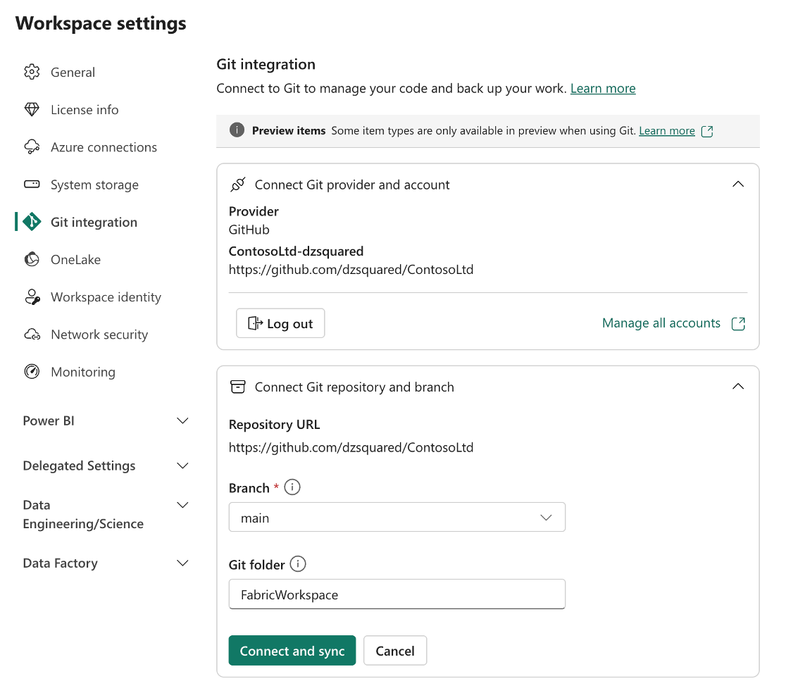

# Fabric SQL CI example

This repository contains a sample where a basic CI pipeline is used to validate changes from both PRs and changes to the main branch.

## Fabric integrated source control

Fabric integrated source control for SQL database and Data warehouse in Fabric is based on the [SQL project](https://aka.ms/sqlproject) development model. This means that the source control is based on a folder structure that contains all the objects in the database and is compatible with the rest of the Microsoft.Build.Sql projects ecosystem.

While the Fabric integration is based on a subset of the SQL projects functionality, we can leverage the same tools and more advanced functionality in external CI/CD systems.

## Code analysis

To leverage code analysis on our SQL project, we must:

1. Enable `RunSqlCodeAnalysis` in the project file. This will enable the code analysis on build.

This example goes further to:

2. Add a package reference to an extended ruleset [ErikEJ.DacFX.SqlServer.Rules](https://www.nuget.org/packages/ErikEJ.DacFX.SqlServer.Rules/) that contains additional rules for SQL code analysis.
3. Applies custom settings for code analysis findings to the project file as the `SqlCodeAnalysisRules` property.

All 3 steps are done by the utility script [SetupSqlCodeAnalysis.ps1](./UtilityScripts/SetupSqlCodeAnalysis.ps1) and the custom settings for the rules are read from the [SqlCodeAnalysis.config](./UtilityScripts/SqlCodeAnalysis.config) file.

## Pretty output

Each CI system will have an option to summarize the job findings, and in GitHub the environment variable `GITHUB_STEP_SUMMARY` is used to write the summary. The [CodeAnalysisOutput.ps1](./UtilityScripts/CodeAnalysisOutput.ps1) script is used to parse the `dotnet build` output and write the summary in a markdown format.

*Note: The code analysis results are also output to an XML file in the `bin/Debug` folder. This file can/should be used instead of the build output for more reliable parsing.*

## License

This sample is licensed under the MIT License - see the [LICENSE](LICENSE) file for details.
